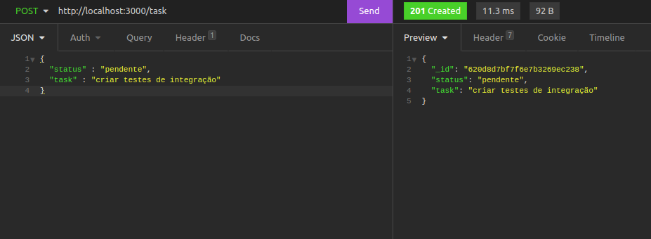
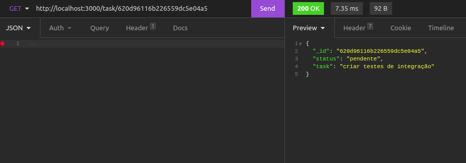
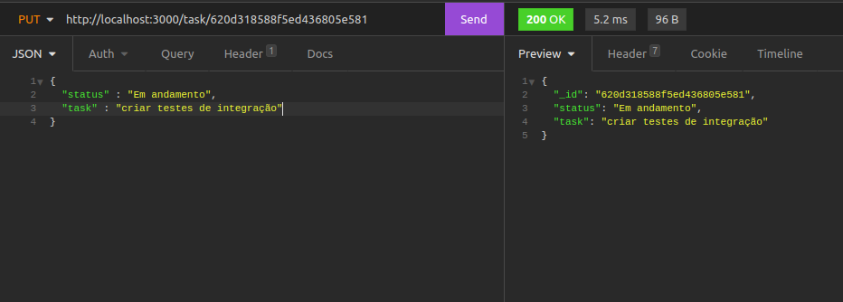
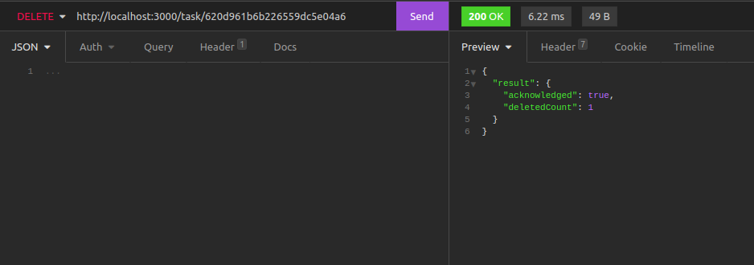

# list-task


Bem vindo ao meu projeto que registra e devolve tarefas
## Habilidades
Neste projeto usei de API's REST com um modelo MSC.

usei o node.JS  que é a ferramenta do Google Chrome responsável por ler e executar as instruções que escrevo em JavaScript,ele é um runteme  do JavaScript.

usei o express que  é um framework Node.js criado para facilitar a criação de APIs HTTP com Node.

usei um banco não relacional MongoDB para armazenar os dados.

## clone
faça o clone do projeto com o seguinte comando em seu terminal 
`git clone git@github.com:aythan-azevedo/list-task.git`
e entrar
`cd list-task`
## Necessário
-para conseguir execultar o projeto você vai precisar de um simulador de cliente como o insominia 

==> https://www.bitbaru.com/site/como-instalar-o-insomnia-no-linux-crie-solicitaes-http-e-obtenha-informaes-detalhadas/

- é necessário instalar as dependências do node.js com o comando: `npm install node`
-caso não tenha o mongodb instalado segue aqui um tutuorial==> https://docs.mongodb.com/manual/installation/
- inicie o projeto com o comando `npm start`
## criando um usuário 
insira esse endereço no cliente que você está usando com a modalidade post.
`http://localhost:3000/task`
e coloque o comando nele assim como no exemplo
``` 
{
	"status" : "pendente",
	"task" : "criar testes de integração"
}
```
exemplo: 


==> insira esse endereço no cliente que você está usando com a modalidade get.
`http://localhost:3000/task`
==> apenas isso ira trazer uma lista com todas as tasks.


==> se quiser uma task especifica coloque o id na url.
`http://localhost:3000/task/_id`



==> para alterar uma task coloca o id na url e a informação editada no corpo da requisição.
`http://localhost:3000/task/_id`

``` 
{
	"status" : "em andamento",
	"task" : "criar testes de integração"
}




==> se o saldo da conta for maior que 10000 a api não permite mais depositos

==>


## Transferir

==> insira esse endereço no cliente que você está usando com a modalidade put.
`http://localhost:3000/transfer`

==> para tranferir é necessario o cpf do pagante e do recebedor assim como o valor:

``` 
{
  "valor": 2000,
  "pagador_cpf": 78945612305,
  "beneficiado_cpf": 78945612306
}
```


==> quando se tenta transferir mais do que se tem na conta a api impede e responde :


++>não tem nenhuma taxa para fazer transferencias ou depositos mas é possivel implementar isso em services.

## extras
==> você pode pegar todas as contas criadas pelo endpont com o verbo GET ao invez de post ou put:
`http://localhost:3000/users`

==> támbem é possivel deletar a conta através do endpoint com o id da conta:

`http://localhost:3000/delete/{id fornecido pela sua maquina no cliente}`
onde o id tem que ser adcionado como parâmetro na url


==> por fim quero agradecer por ter chegado até aqui e comente no codigo dicas se achar que posso melhorar.

## OBRIGADO.