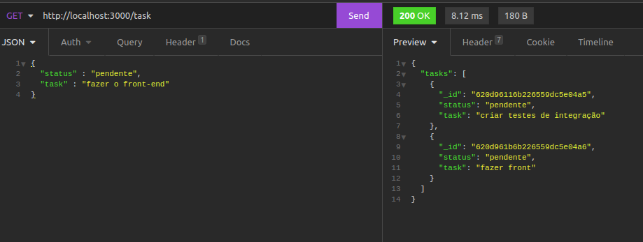

# list-task


Bem vindo ao meu projeto que registra e devolve tarefas
## Habilidades
Neste projeto usei de API's REST com um modelo MSC.

usei o node.JS  que é a ferramenta do Google Chrome responsável por ler e executar as instruções que escrevo em JavaScript,ele é um runteme  do JavaScript.

usei o express que  é um framework Node.js criado para facilitar a criação de APIs HTTP com Node.

usei um banco não relacional MongoDB para armazenar os dados.

## clone
faça o clone do projeto com o seguinte comando em seu terminal 
`git clone git@github.com:aythan-azevedo/list-task.git`
e entrar
`cd list-task`
## Necessário
-para conseguir execultar o projeto você vai precisar de um simulador de cliente como o insominia 

==> https://www.bitbaru.com/site/como-instalar-o-insomnia-no-linux-crie-solicitaes-http-e-obtenha-informaes-detalhadas/

- é necessário instalar as dependências do node.js com o comando: `npm install node`
-caso não tenha o mongodb instalado segue aqui um tutuorial==> https://docs.mongodb.com/manual/installation/
- inicie o projeto com o comando `npm start` 
-para rodar os testes `npm run test`
## criando um usuário 
insira esse endereço no cliente que você está usando com a modalidade post.
`http://localhost:3000/task`
e coloque o comando nele assim como no exemplo
``` 
{
	"status" : "pendente",
	"task" : "criar testes de integração"
}
```
exemplo: 


==> insira esse endereço no cliente que você está usando com a modalidade get.
`http://localhost:3000/task`
==> apenas isso ira trazer uma lista com todas as tasks.



==> se quiser uma task especifica coloque o id na url na modalidade put.
`http://localhost:3000/task/_id`


==> para alterar uma task coloca o id na url e a informação editada no corpo da requisição.
`http://localhost:3000/task/_id`

``` 
{
	"status" : "em andamento",
	"task" : "criar testes de integração"
}
```


==> para deletar uma task coloque o id na url na modalidade delete.

`http://localhost:3000/task/_id`


## OBRIGADO.